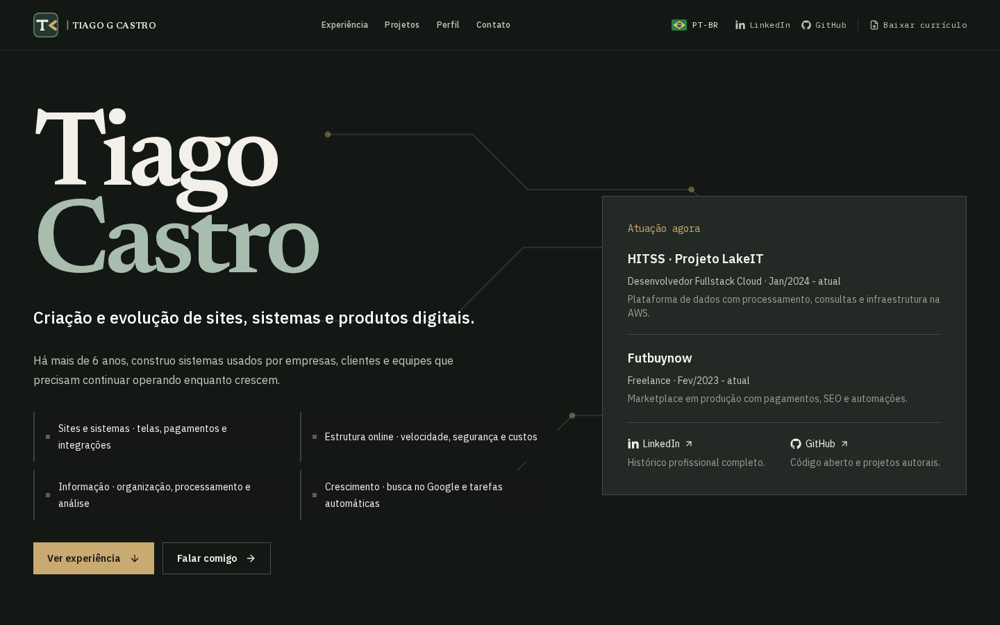
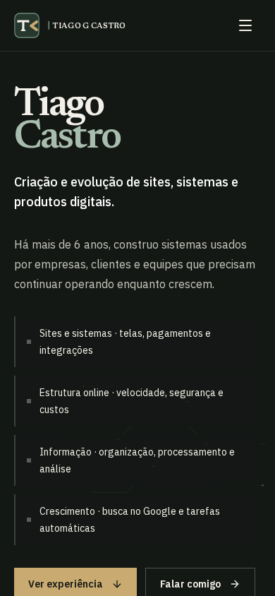

# Tiago G Castro | Portfolio

Professional portfolio of Tiago Castro, a Full Stack Developer with over six years of experience building and evolving production software across backend, cloud, data, and infrastructure.

[tiagogcastro.com.br](https://tiagogcastro.com.br)

## Preview

<p align="center">
  <a href="https://tiagogcastro.com.br">
    
  </a>
</p>
<p align="center">
  <a href="https://tiagogcastro.com.br">
    
  </a>
</p>

## About

This website presents my experience through real-world projects, responsibilities, and measurable outcomes. Instead of reproducing a traditional resume, it connects business context, engineering work, and production impact.

The main case studies are:

- LakeIT: an enterprise data platform involving AWS infrastructure, Terraform, data pipelines, and applied AI.
- Futbuynow: a marketplace covering payments, SEO, analytics, automation, and day-to-day technical ownership.
- Personal and open source projects focused on AI, cloud, and developer productivity.

## Highlights

- Responsive editorial design for desktop and mobile.
- Localized content powered by `next-intl`.
- Professional case studies centered on impact and measurable results.
- Dynamic Open Graph image, metadata, JSON-LD, sitemap, and robots configuration.
- Downloadable resumes in Portuguese and English.
- Motion with support for `prefers-reduced-motion`.

## Tech Stack

- Next.js 16 and React 19
- TypeScript in strict mode
- Tailwind CSS 4
- next-intl
- Motion
- Lucide React
- Yarn 4

## Running Locally

Requirements:

- Node.js 20.9 or newer
- Corepack enabled

```bash
corepack enable
yarn install
yarn dev
```

The development server starts at [localhost:3000](http://localhost:3000).

## Scripts

```bash
yarn dev        # start the development server
yarn lint       # run static analysis
yarn typecheck  # check TypeScript types
yarn build      # create a production build
yarn check      # run lint, type checking, and build
yarn format     # format files with Prettier
```

## Project Structure

```text
messages/               interface translations
public/resume/          downloadable resumes
src/app/                routes, metadata, and global styles
src/components/         shared components
src/config/             public site configuration
src/content/            structured content
src/features/home/      home page sections and components
src/i18n/               locale routing and configuration
```

## Internationalization

Brazilian Portuguese is the default locale and is served from `/`. The routing structure supports additional languages through locale-prefixed paths.

All visible copy is maintained in `messages/pt-BR.json`, including labels, dates, and accessible text.

## Deployment

The project can be deployed directly to Vercel and currently requires no environment variables.

Run the complete verification pipeline before deploying:

```bash
yarn check
```

## License

The source code is available under the [MIT License](LICENSE).

Resumes, biographical information, portfolio copy, professional data, and visual identity assets are excluded from the code license. See the [Content Notice](CONTENT_NOTICE.md) for details.
